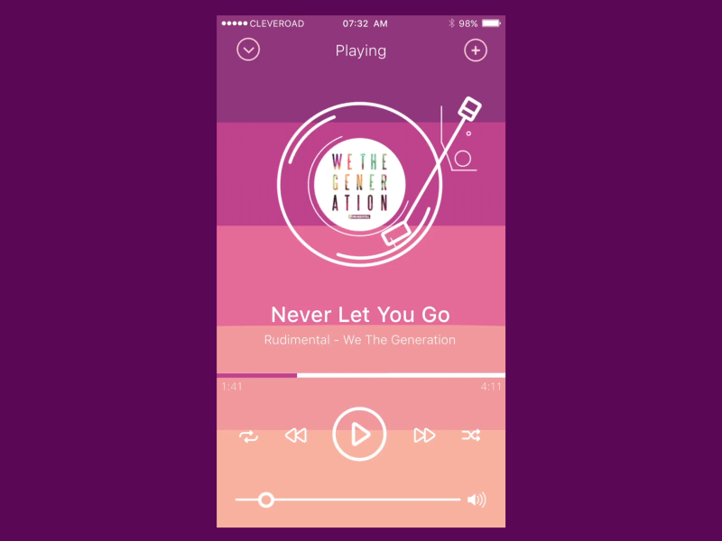
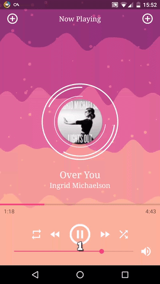
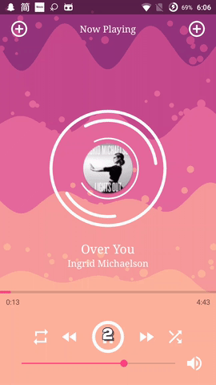

#Fancy Music Spectrum Animation

I am impressed with the animation from dribble and decided to write an implementation of the following animation.

Also, I have found the implementation of their product [Wave In App - CleverRoad Github](https://github.com/Cleveroad/WaveInApp). The code is written in OpenGL and the animation is repeating in  consistent pattern compare to the fancy animation that shown in their showcase.

Thus, I decided to write an implementation with Android Canvas.

##Animation Preview

